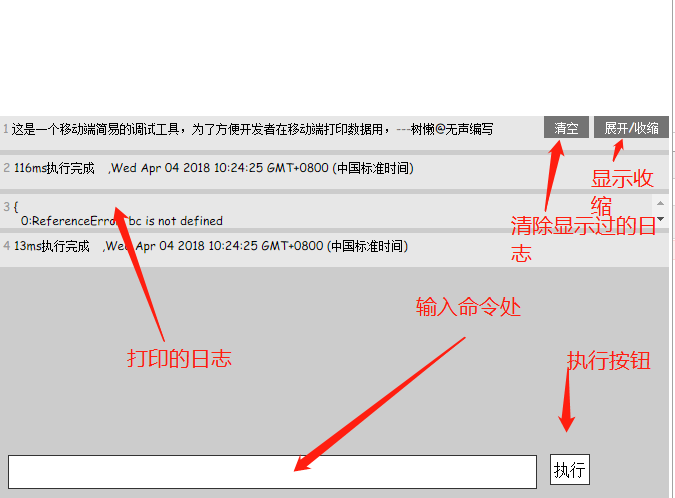

# mobile-log" 
 这是一个移动端简易的调试工具，为了方便开发者在移动端打印数据用，---树懒@无声编写

 只可以输入变量来，兼容一般的命令行使用方式，可以打印出来;



---
### 由于一些变量的信息有一些多例如window，document等；已经做了一些字符串的忽略，加快显示速度；
### 另外显示的层级设置了最多是10层；超过10层会显示出来他的toString后的内容；
### 暴露了了两个方法 `ignore` 传入要忽略的键名  `deep`  直接赋值层级 
```js
mobConsole.ignore('keys') // 忽略输出的键值（全局定义）
mobConsole.deep = 20 // 默认 深度为20
```
### 使用
`npm i mobile-log" -S`
```js
// 1.直接引入即可
require('mobile-log"')

// 2. 需要设置忽略项的
let mobConsole = require('mobile-log"')
mobConsole.ignore('keys)
```
[点击预览效果](http://cdn.bestsloth.top/cdn/handleErr/)